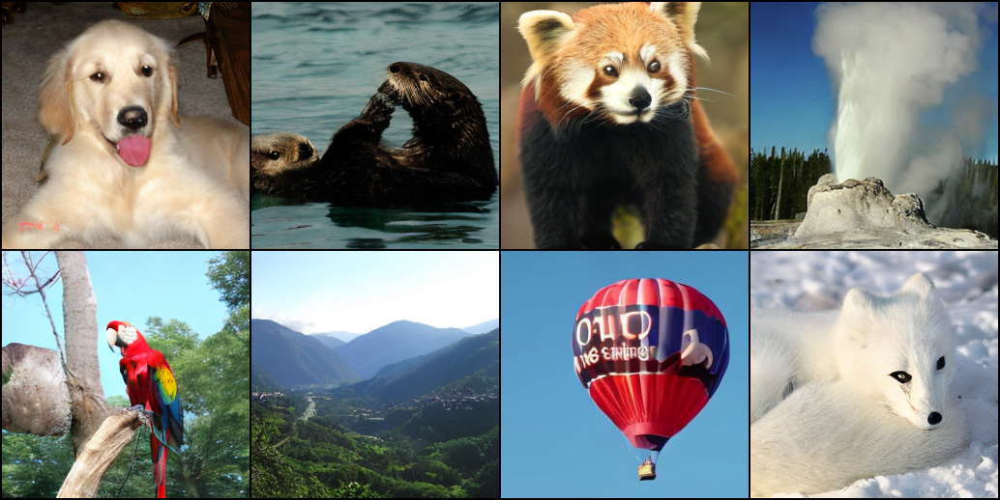
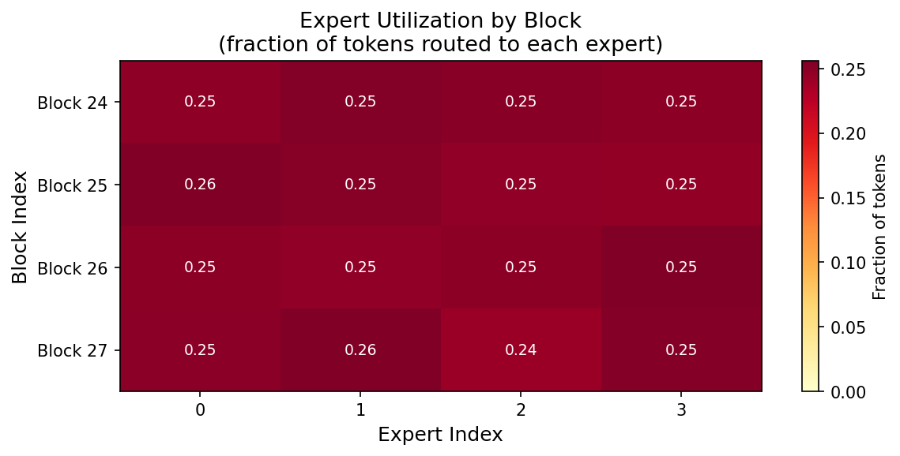
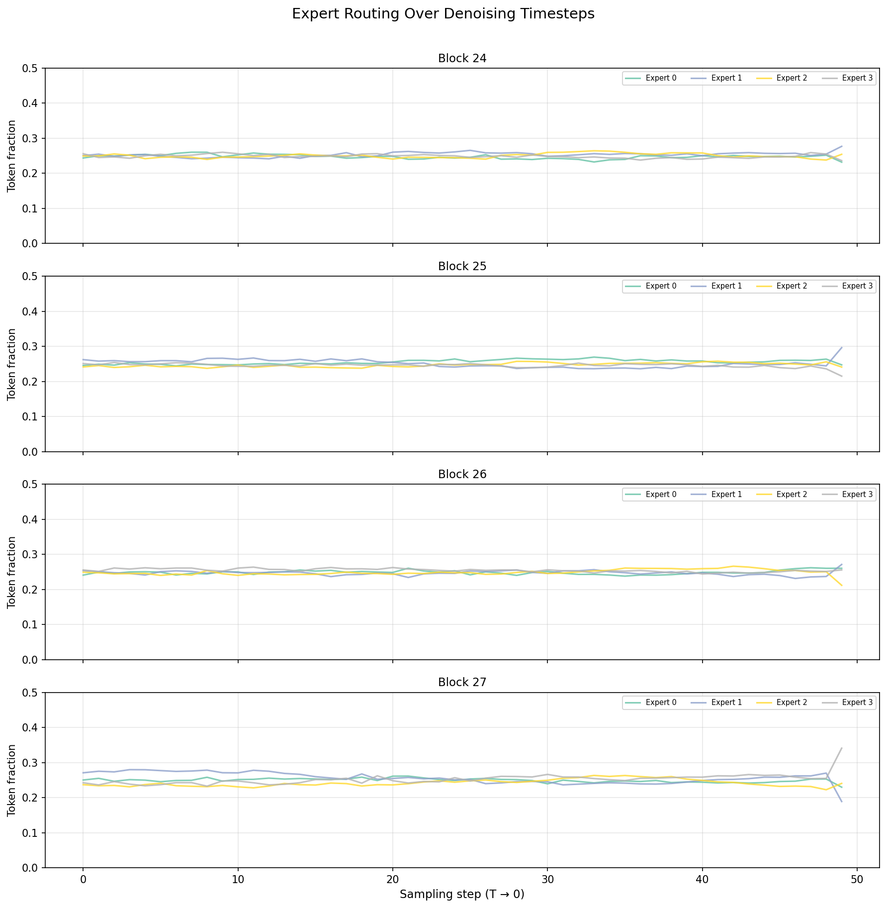
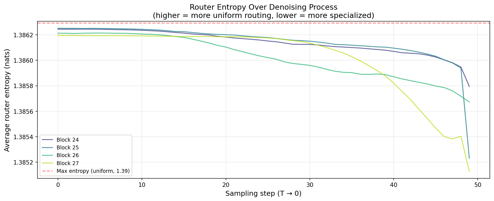

# CD-MoE: Concept-Driven Mixture-of-Experts for Diffusion Transformers

> **Personal research repository** — Reimplementing and extending [Diff-MoE](https://arxiv.org/abs/2305.19276) as a foundation for concept-driven sparse expert routing in diffusion transformers.

Built on top of [DiT (Peebles & Xie, 2022)](https://arxiv.org/abs/2212.09748).

---

## 🎯 Research Goal

Standard diffusion transformers (DiT) use **dense FFN layers** that apply the same computation to every token at every denoising step. This is wasteful — intuitively, generating a "dog" vs a "hot air balloon" should activate different neural pathways.

**Our hypothesis:** Expert routing in diffusion models should be driven by *semantic concepts* — not just token position or noise level. We want experts to specialize around ImageNet concepts (textures, shapes, scene types) rather than learning arbitrary statistical partitions.

**Two-stage plan:**
1. ✅ **Stage 1 (done):** Reimplement Diff-MoE — replace dense FFN blocks with sparse MoE in DiT-XL/2, finetune on ImageNet, analyze routing patterns.
2. 🔬 **Stage 2 (in progress):** CD-MoE — design a concept-conditioned router that explicitly routes tokens based on semantic class embeddings.

---

## ✅ Stage 1: Diff-MoE Reimplementation

We replaced the last 4 FFN blocks (blocks 24–27) of DiT-XL/2 with **Sparse Mixture-of-Experts** blocks and finetuned on ImageNet for 105,000 steps.

### Architecture
- **Base model:** DiT-XL/2 (676M params, pretrained on ImageNet 256×256)
- **MoE blocks:** Blocks 24, 25, 26, 27 (last 4 of 28)
- **Experts:** 4 routed experts + 2 shared experts per block
- **Routing:** Top-2 sparse routing with load-balancing auxiliary loss
- **Trainable params:** Only MoE blocks (~140 params); backbone frozen

### Key Results

**Generated images after 105k steps of finetuning:**



**Expert utilization heatmap (post-finetuning):**



**Temporal routing — experts specialize by denoising stage:**



**Router entropy over denoising steps:**



### Routing Analysis Findings

| Finding | What it means |
|---------|--------------|
| **Temporal specialization** | At early denoising (high noise), 1-2 experts dominate per block. By later steps (clean image), routing equalizes. Experts learn to specialize by noise level — validating the core Diff-MoE claim. |
| **Non-uniform utilization** | Expert load ranges 17–35% (not perfectly balanced), confirming experts are learning different specializations rather than being identical. |
| **Entropy pattern** | Router entropy starts low at high noise (~1.30 nats) and rises toward max (1.39 nats) as image cleans up — router is more decisive/confident during early coarse generation. |
| **Block 26 most specialized** | Expert 1 in Block 26 attracts 35% of tokens (highest concentration seen), suggesting this layer develops the strongest expert specialization. |

---

## 🔬 Stage 2: CD-MoE (Concept-Driven MoE) — In Progress

### The Core Idea

Instead of learning routing from scratch (as in Diff-MoE), **explicitly condition the router on semantic concept embeddings**:

```
Standard MoE router:   token_hidden → softmax → expert weights
CD-MoE router:         token_hidden + class_embedding → softmax → expert weights
```

This means expert 0 might learn to handle "furry textures" (dogs, cats, bears), expert 1 learns "geometric structures" (buildings, vehicles), etc. — driven by the ImageNet class label rather than implicit statistics.

### Planned Experiments

- [ ] **A1:** Compute class-level activation centroids — do ImageNet classes cluster in hidden space?
- [ ] **A3:** Block sweep — which DiT blocks show strongest concept separation?
- [ ] **C0/C1:** Linear probes on token activations — can we predict class from a token's expert assignment?
- [ ] **CD-MoE v1:** Concatenate CLIP class embedding to gate input, retrain router
- [ ] **CD-MoE v2:** Cross-attention between token and class prototype before routing
- [ ] **Evaluation:** FID comparison vs Diff-MoE baseline, expert specialization metrics

---

## 🗂️ Repository Structure

```
DiT/
├── models.py                    # DiT + DiT_MoE model definitions
├── moe/                         # MoE implementation
│   ├── moe_gate.py              # Sparse router (Top-k + load balancing)
│   ├── moe_experts.py           # SwiGLU expert MLPs
│   ├── sparse_moe_block.py      # Full sparse MoE block
│   └── dit_block_moe.py         # DiTBlock with MoE FFN
├── finetune_moe.py              # Finetuning script (backbone frozen)
├── sample_diffmoe.py            # Sampling from MoE checkpoints
├── analyze_routing.py           # Expert routing visualization
├── training_watchdog.sh         # Auto-resume watchdog for cluster training
├── cleanup_checkpoints.py       # Disk quota management
├── routing_analysis/            # Pre-finetuning routing plots
├── routing_analysis_finetuned/  # Post-finetuning routing plots
├── routing_analysis_105k/       # Final 105k checkpoint routing plots
├── A1_class_centroids.py        # Class activation centroid analysis
├── A3_block_sweep.py            # Block-level concept separation sweep
├── C0_linear_probe.py           # Linear probe on token activations
├── C1_token_probe.py            # Token-level expert probe
└── C6_generalization_test.py    # Cross-class generalization test
```

---

## ⚙️ Setup

```bash
git clone https://github.com/ankitaawasthi-17/Diff-MoE-DiT.git
cd Diff-MoE-DiT
conda env create -f environment.yml
conda activate dit
```

Download the pretrained DiT-XL/2 checkpoint:
```bash
mkdir pretrained_models
wget https://dl.fbaipublicfiles.com/DiT/models/DiT-XL-2-256x256.pt -O pretrained_models/DiT-XL-2-256x256.pt
```

## 🚀 Usage

**Finetune MoE blocks on ImageNet:**
```bash
python finetune_moe.py \
    --data-path /path/to/imagenet/train \
    --ckpt pretrained_models/DiT-XL-2-256x256.pt \
    --moe-blocks 24 25 26 27 \
    --num-experts 4 \
    --epochs 1
```

**Sample from a finetuned checkpoint:**
```bash
python sample_diffmoe.py \
    --ckpt /path/to/checkpoint.pt \
    --moe-blocks 24 25 26 27 \
    --num-experts 4 \
    --num-sampling-steps 250 \
    --output sample_out.png
```

**Analyze expert routing:**
```bash
python analyze_routing.py \
    --ckpt /path/to/checkpoint.pt \
    --moe-blocks 24 25 26 27 \
    --num-experts 4 \
    --output-dir routing_analysis_out/
```

---

## 📚 References

- [Diff-MoE: Diffusion Transformer with Mixture of Experts](https://arxiv.org/abs/2305.19276)
- [Scalable Diffusion Models with Transformers (DiT)](https://arxiv.org/abs/2212.09748)
- [Mixtral of Experts](https://arxiv.org/abs/2401.04088) — MoE routing inspiration

---

*Base DiT code from [facebookresearch/DiT](https://github.com/facebookresearch/DiT) (CC-BY-NC License).*
